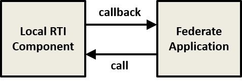
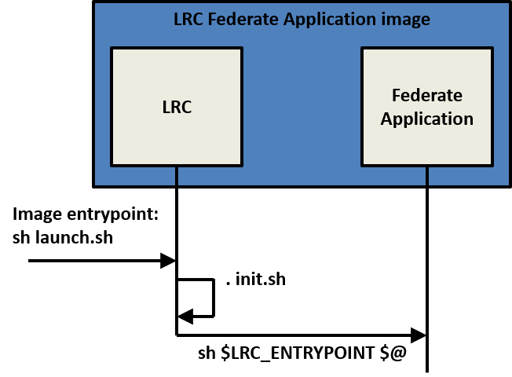

# LRC containerization patterns

## Introduction

In order for a federate application to interact with the HLA Run Time Infrastructure (RTI) it must first connect to a so called Local RTI Component (LRC). All interactions between federate application and RTI are handled by the LRC. The LRC is combined with each federate application. When the federate application initiates an RTI service, it calls the LRC, and when the RTI initiates a federate service, the LRC calls the federate application. These interactions between LRC and Federate Application are illustrated below.



The LRC is specific to an RTI vendor. Although the API between federate application and the LRC is standardized, there are often many LRC specific settings that are passed in via configuration file or environment variables.

Typically, the LRC is provided as a dynamically linked library. In fact, the HLA Interface Specification standard defines dynamic link compatibility for LRCs to allow one RTI vendor’s LRC implementation to be replaced with another without needing recompilation of the federate application. As such, it makes sense to consider providing the LRC as a Docker base container image. The federate application is then “linked”, in some way, to the LRC base image in order to fulfil the LRC dependency.

To support the linking, the LRC base image provides a script, `launch.sh`, that provides the default launch process for all federate application containers. This script may read environment variables and command line options and uses that information to modify LRC specific configuration files. As such, `launch.sh` will be different for each vendor’s LRC.

The `launch.sh` script launches the federate application by looking for a command in the `LRC_ENTRYPOINT` environment variable. The command is supplied by the federate application image. How the federate application image provides this command, and sets the `LRC_ENTRYPOINT` environment variable, is the major difference between the design patterns presented in the next subsections:

- containerization via extension
- containerization via composition of the application
- containerization via composition of the LRC

## Containerization via extension

Linking by extension takes the traditional approach of building a federate application image based on an LRC image. The federate application “extension” adds the application code in a new file system layer. Running the federate is then a matter of starting a container from the federate application image. While this approach is conceptually simple, it suffers from the need for there to be individual federate images for each RTI vendor’s LRC. However, this is not a huge burden given the limited number of RTIs in existence.

In this pattern, the container image of the federate application is built using the Dockerfile `FROM`
instruction. The `FROM` instruction sets the base image for the federate application, in this case an LRC image. The LRC is combined with the federate application at **image build time**. The following illustrates this concept, where an LRC image is “extended” to build the LRC Federate Application image. The green color is used to indicate that an image is a base image, as opposed to an application image (in blue).


As an example, consider building a federate application image based on `pitch/lrc:5.5.0.0-alpine`, a small image based on Alpine Linux, with Pitch LRC version 5.5.0.0 and Java Runtime Engine 8 installed.
The Dockerfile for building the federate application image looks as follows:

````
FROM pitch-lrc:5.5.0.0-alpine

# Install application
COPY ./application /root/application

# Set entrypoint
ENV LRC_ENTRYPOINT=/root/application/start.sh
````

This Dockerfile does the following three things:

- It sets the base image to `pitch-lrc:5.5.0.0-alpine`
- It copies the application directory, containing the federate application, to the filesystem of the container
  at /root/application
- It defines the environment variable `LRC_ENTRYPOINT`, setting it to the name of a shell script that is used to start the federate application (in this example `start.sh`)

The installation directory can be anywhere in the container’s filesystem, so long as the `LRC_ENTRYPOINT`
environment variable points to a shell script that starts the federate application.

The call sequence for calling `start.sh` is illustrated in the figure below. The container image entry point (different from the `LRC_ENTRYPOINT` environment variable above) points to a launch script called `launch.sh`, provided by the LRC image. This launch script will be invoked when the container is started. The launch script performs LRC specific initialization actions via the `init.sh` script, and invokes the federate application start script through the environment variable `LRC_ENTRYPOINT`. Note that the environment variable `LRC_ENTRYPOINT` is an LRC image convention and should not be confused with the container image entry point.



The start script is federate application specific and will receive all the container command line options (if any) from the callee (the `launch.sh` script in the base LRC image). For a Java federate application, the start script may be as follows:

````
#!/bin/sh
java -cp MyApplication.jar:$CLASSPATH myapplication.Main $@
````

The environment variable `CLASSPATH` is set by the LRC image and has all the necessary LRC jar
files for interacting with the RTI (equivalent environment variables are set in the LRC image for
sourcing C++ shared object libraries). The command line options are passed on to the federate application via `$@`.

## Containerization via composition of the application

This pattern makes use of volume mounts to source the federate application. The federate application is installed into an image based on some small base image that provides rudimentary file system operations. This installed location is exposed via a volume that is mounted into the LRC container, which acts as a plugin manager for the application code. This approach has the benefit of removing the tight coupling between the LRC and federate application images but with the cost of needing two containers to run each federate.

In this pattern, the container image of the federate application is built without reference to an LRC 
image. The LRC is combined with the federate application at **image run time**. The following figure illustrates this concept.


In this pattern, the federate application installation directory must be declared as a volume (which will be
mounted into the LRC base image). A default, dummy command must be specified for the container to execute. The default command needs to be defined in order for the container to start. However, the command can exit immediately, stopping the federate application container. So long as the federate application container is not removed from the host computer, its declared volume mounts, which contain the federate application code, will persist and be accessible for use by other containers.

The Dockerfile for the federate application may look like:

````
FROM alpine:3.3

# Install application
COPY ./application /root/application

# Make application available as a volume
VOLUME ["/root/application"]

# Dummy command
CMD ["/bin/true"]
````

This Dockerfile does the following:

- It sets the base image to alpine:3.3

- It copies the application directory to the filesystem of the container at /root/application

- It declares the installation directory as a VOLUME

- And it sets CMD to a default

Important to note is that the federate application image does not include an LRC or a runtime environment, but only the compiled application logic and supporting files. Therefore, it can be built using a small base image, like Alpine Linux. Thus, the federate container image can potentially be very small.

The federate application image is run by combining it with an LRC image at run-time; this can be any LRC
(Portico, Pitch, MÄK). The following Docker Compose file fragment illustrates this container composition.

````
services:

# ...

 myapplication:
  image: myapplication
  volumes:
  - myapp:/root/application

 myservice:
  image: pitch-lrc:5.5.0.0-alpine
  volumes:
  - myapp:/root/application:nocopy
  environment:
  - LRC_ENTRYPOINT=/root/application/start.sh
  depends_on:
  - myapplication

volumes
 myapp:
````

This Docker Compose fragment shows two service definitions:

- `myapplication`: declares the federate application image that contains the application logic;

- `myservice`: is the container that will actually be running the federate.

In `myservice` the following is done:

- the LRC image is specified, in this example `pitch-lrc:5.5.0.0-alpine`,

- the federate application logic from `myapplication` is mounted, and

- the `LRC_ENTRYPOINT` variable is set.

The `LRC_ENTRYPOINT` variable must be set to the name of the shell script that starts the federate application (in this example, the federate application’s `start.sh` is located within the volume mounted by the `myapplication` container). The call sequence is identical to the extension pattern.

## Containerization via composition of the LRC

This pattern is similar to the previous pattern, but the volume mount is in the other direction. The LRC is mounted as a volume into the federate application. The advantage with this pattern is that the federate application can use its own run-time execution libraries, installed in the Federate Application image.


The main difference with the other composition pattern is that the launch script in the LRC image must be explicitly defined as entry point for the federate application. The launch script in the LRC image is located under `/usr/local/lrc`, irrespective of what RTI is used. The following compose fragment illustrates the composition:

````
services:

# ...

 app:
  image: start:app-alpine
  entrypoint: /usr/local/lrc/launch.sh
  volumes:
  - mylrc:/usr/local/lrc:nocopy
  environment:
  - LRC_ENTRYPOINT=/root/application/start.sh
  depends_on:
  - lrc

 lrc:
  image: pitch-lrc:5.5.0.0
  volumes:
  - mylrc:/usr/local/lrc

volumes:
 mylrc:
````

